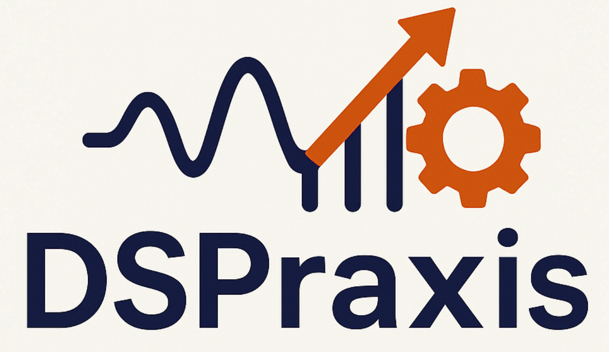

# DSPraxis

My personal Digital Signal Processing (DSP) practice and learning space. This repository serves as my comprehensive DSP playground, covering theory, implementation, and FPGA deployment across multiple programming languages and platforms.

## 🎯 About This Space

DSPraxis is my structured approach to mastering DSP concepts through hands-on practice. It's organized in three progressive phases that I follow to build my skills from fundamentals to advanced FPGA implementations.

## 📚 My Learning Structure

### 1. 🚀 DSP Bootcamp
**Location: `bootcamp/`**

My foundational practice area for essential programming skills in DSP modeling:
- **Python**: Practicing with NumPy, SciPy, Matplotlib for signal processing and visualization
- **Octave**: Working with Signal Processing Toolbox, Simulink compatibility for algorithm development
- **C**: Exploring real-time processing, optimization, and embedded systems preparation

*My starting point for building programming foundations for DSP applications.*

### 2. 🔬 DSP Practice Projects
**Location: `practice/`**

My topic-by-topic DSP implementation practice across multiple languages:
- **Core DSP Topics**: Filtering, FFT, Convolution, Correlation, Modulation
- **Multi-Language Practice**: Python, Octave, C, SystemVerilog implementations
- **Real-world Applications**: Audio processing, Image processing, Communications
- **Performance Analysis**: Understanding trade-offs between different implementations

*Each topic includes my theory notes, implementation attempts, and performance observations.*

### 3. ⚡ FPGA Implementation
**Location: `fpga/`**

My progressive FPGA-based DSP practice projects:
- **Beginner Projects**: Simple logic, counters, basic signal generation
- **Intermediate**: Digital filters, FFT implementations, basic DSP blocks
- **Advanced**: Complete DSP systems, real-time processing, optimization
- **Tools**: VHDL/Verilog, Vivado/Quartus, simulation and synthesis practice

*My journey from basic FPGA concepts to complex DSP system deployment.*

## 🛠️ Technologies I'm Working With

### Programming Languages
- **Python**: NumPy, SciPy, Matplotlib, Jupyter (using virtual environments)
- **Octave**: Signal Processing Toolbox, Simulink compatibility
- **C**: GCC, Make, CMake
- **SystemVerilog**: Verilator, GTKWave

### FPGA Development (Open Source)
- **Synthesis**: Yosys
- **Place & Route**: nxtPNR
- **Bitstream Generation**: Project IceStorm (for Lattice iCE40)
- **Simulation**: Verilator, GTKWave

### Development Tools
- **Version Control**: Git
- **Documentation**: Markdown, LaTeX
- **Python Environment**: venv, requirements.txt
- **Simulation**: Python, Octave, Verilator

## 🚀 My Setup

### Prerequisites
- Python 3.8+ with venv
- Octave (with Signal Processing Toolbox)
- C compiler (GCC)
- Open-source FPGA tools: Yosys, nxtPNR, Project IceStorm
- Verilator and GTKWave for Verilog simulation

### My Workflow
```bash
# Clone my practice repository
git clone https://github.com/yourusername/DSPraxis.git
cd DSPraxis

# Set up Python virtual environment
python -m venv venv
source venv/bin/activate  # On Windows: venv\Scripts\activate
pip install -r requirements.txt

# Start with bootcamp exercises
cd bootcamp/python
python signal_processing_basics.py
```

## 📖 My Learning Path

1. **Bootcamp Phase**: Build programming foundations
2. **Practice Phase**: Implement DSP algorithms across languages
3. **FPGA Phase**: Deploy DSP systems on hardware

## 📝 Notes

This is my personal practice space where I:
- Experiment with DSP concepts
- Compare implementations across different languages
- Document my learning progress
- Build a portfolio of DSP projects

---

**My DSP Learning Journey 🎵📡🔬**
